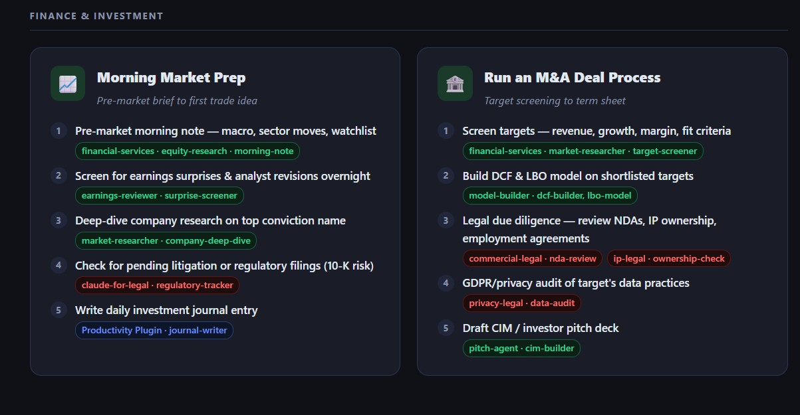

# Anthropic Plugin Workflows

A user-first reference and workflow guide for Claude's official plugin ecosystem — organized by **what you want to accomplish**, not by which repo a skill lives in.

**Live site:** https://az9713.github.io/anthropic-plugin-workflows/

---

## What Makes This Different

Most plugin documentation is written for technical professionals and organized by repository. This project flips that: every skill is translated into plain English, and the **Workflows tab** shows how to combine skills from multiple plugins and repos to complete a real-world goal end-to-end.

---

## The Three Views

| Tab | What it shows |
|-----|--------------|
| **Plugin Overview** | Card-per-plugin summary with personal-use highlights and integrations |
| **Skill Detail** | Every skill across all 5 repos — searchable, collapsible, color-coded |
| **Workflows** | Cross-repo step-by-step workflows grouped by user goal |

Open `index.html` locally in any browser — fully self-contained, no server or dependencies needed.

---

## Workflow Categories

- **Professional** — Quarterly planning, engineer onboarding, research project launch
- **Legal & Contracts** — Vendor contract review, workplace investigations
- **Finance & Investment** — Morning market prep, M&A deal process
- **Personal & Freelance** — Start a freelance engagement, build a personal brand
- **Startup & Business** — Raise a seed round, ship a product feature

Each workflow card lists numbered steps, the specific skill for each step, and which plugin/repo provides it — with color-coded badges (blue = knowledge-work, purple = official tools, green = financial services, amber = community, red = legal).

---

## The Five Source Repositories

| # | Repo | Scope |
|---|------|-------|
| 1 | [knowledge-work-plugins](https://github.com/anthropics/knowledge-work-plugins) | 18 office-profession plugins (sales, HR, ops, marketing, engineering…) |
| 2 | [claude-plugins-official](https://github.com/anthropics/claude-plugins-official) | 44 developer-focused plugins (git, code review, LSP…) |
| 3 | [financial-services](https://github.com/anthropics/financial-services) | 19 Wall Street plugins (IB, equity research, PE, fund admin…) |
| 4 | [claude-plugins-community](https://github.com/anthropics/claude-plugins-community) | 600+ community plugins |
| 5 | [claude-for-legal](https://github.com/anthropics/claude-for-legal) | 12 legal plugins (contracts, IP, privacy, employment, litigation…) |

---

## How It Was Built

**Phase 1 — Plugin overview:** Five parallel research agents fetched each repo simultaneously via the GitHub API, producing a card-based directory with a plain-English quick-reference table.

**Phase 2 — Skill deep dive:** A second agent pass drilled into every plugin's skill files. Each skill was documented with what it does, when to use it, and what output you get — covering 300+ skills total.

**Phase 3 — Workflow layer:** Skills from across all five repos were combined into cross-repo workflow cards, organized by user goal rather than plugin origin.
